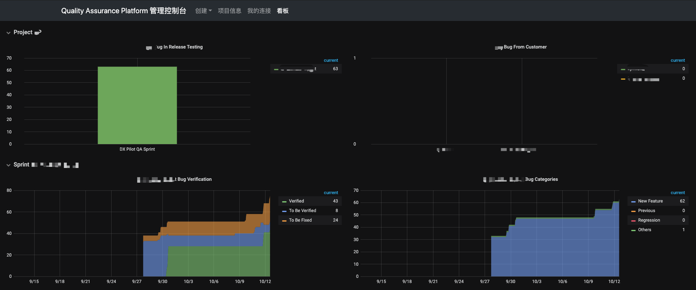
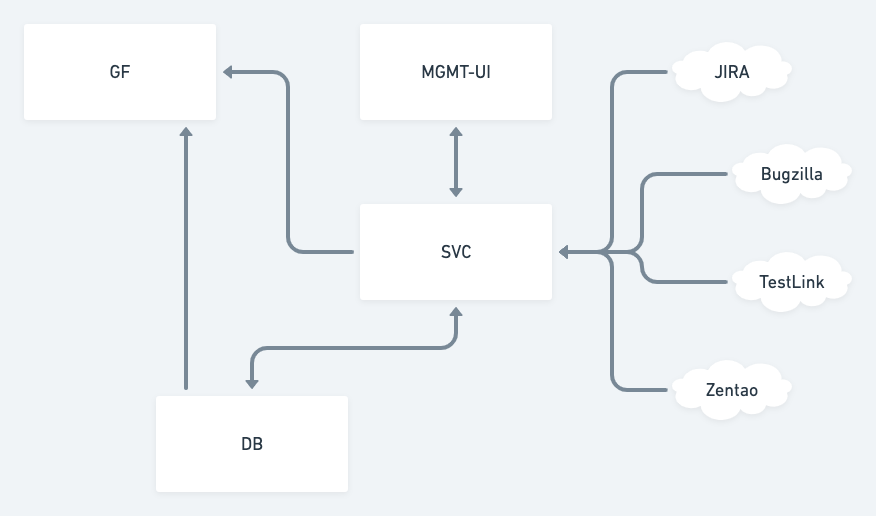

# Quality Assurance Platform

## Screenshots




## Values

## Framework


## API Document
http://{qap-server}/api/ui

## Installation
```bash
wget https://raw.githubusercontent.com/Quality-Assurance-Platform/qap/svc/docker-compose.yaml
docker-compose -f docker-compose.yaml pull
docker-compose -f docker-compose.yaml up -d
```

